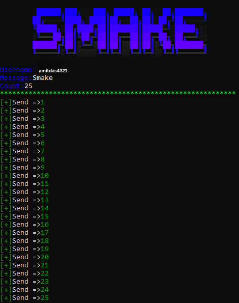

<p align="center">
  
</p>

<p align="center">
  <b>Python script to automate message submissions to NGL.</b>
</p>

<h1 align="center">NGL-Spammer — Python Automation Script</h1>

<p align="center">
  <b>Automation Tool ⚡</b><br>
  Developed by <a href="https://www.amitdas.site/">Amit Das</a>
</p>

---

# 🚀 Overview

This repository contains a **Python automation script** designed to send messages automatically to the **NGL (Not Gonna Lie) service**.

The script allows you to send a specified message to a given **NGL username multiple times** with configurable delays and optional proxy support.

It also includes **automatic retry logic**, **device ID switching**, and **user-agent rotation** when requests fail.

---

# ⚡ Features

- Automated message sending
- Custom message input
- Adjustable number of requests
- Configurable delay between requests
- Optional proxy support
- Automatic proxy switching
- Device ID randomization
- User-Agent rotation after failures
- Success / failure logging in terminal

---

# 🧰 Requirements

- Python 3.x

---

# 📦 Installation

Clone the repository:

```bash
git clone https://github.com/AmitDas4321/NGL-Spammer.git
````

Enter the project directory:

```bash
cd NGL-Spammer
```

Install required dependencies:

```bash
pip install -r requirements.txt
```

Run the script:

```bash
python NGLSpamer.py
```

---

# 🧩 Usage

1. Enter your **NGL username**
2. Enter the **message** you want to send
3. Specify the **number of messages**
4. Enter the **delay between requests (seconds)**

   * For fastest requests, enter **0**
5. Choose whether to **use proxies (y/n)**

If proxies are enabled, ensure that **`proxies.txt` contains valid proxies**.

---

# ⚙️ How It Works

* The script sends automated requests to **ngl.link**
* Each successful request is marked with **`[+]`**
* Failed requests are marked with **`[-]`**

If **4 consecutive failures occur**, the script will:

* Change the **device ID**
* Change the **user-agent**
* Switch to a **new proxy (if enabled)**

---

# 🖼 Screenshot

<p align="center">
  
</p>

---

# ❤️ Support

<p align="center">
  <a href="https://www.buymeacoffee.com/AmitDas4321" target="_blank">
    
  </a>
</p>

---

# 📜 License

MIT License © 2026 Amit Das

---

<p align="center">
  <b>Built with ⚡ using Python</b><br>
  Made with ❤️ by <a href="https://amitdas.site">Amit Das</a>
</p>